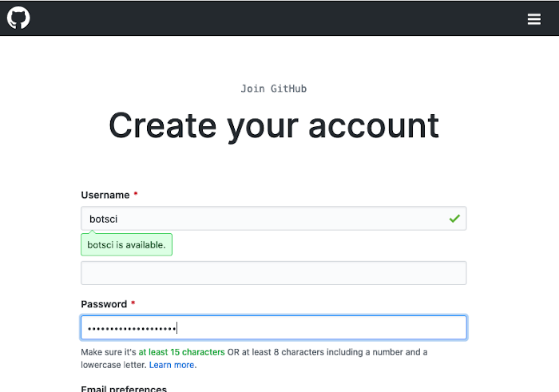
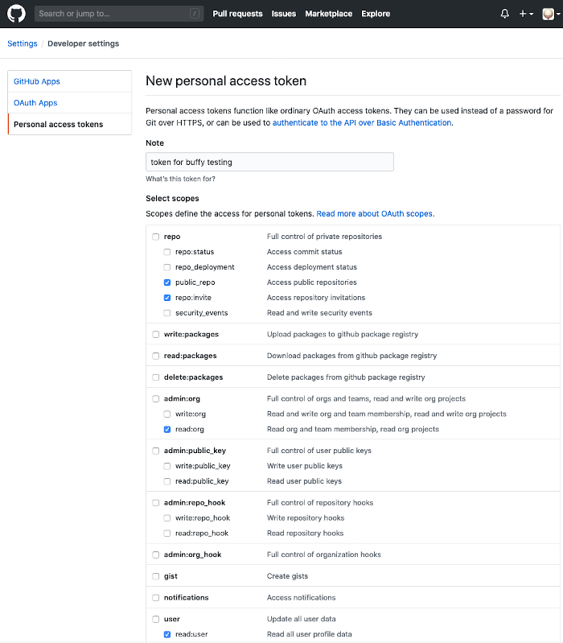
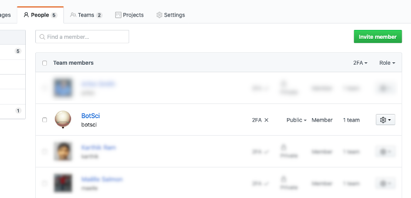
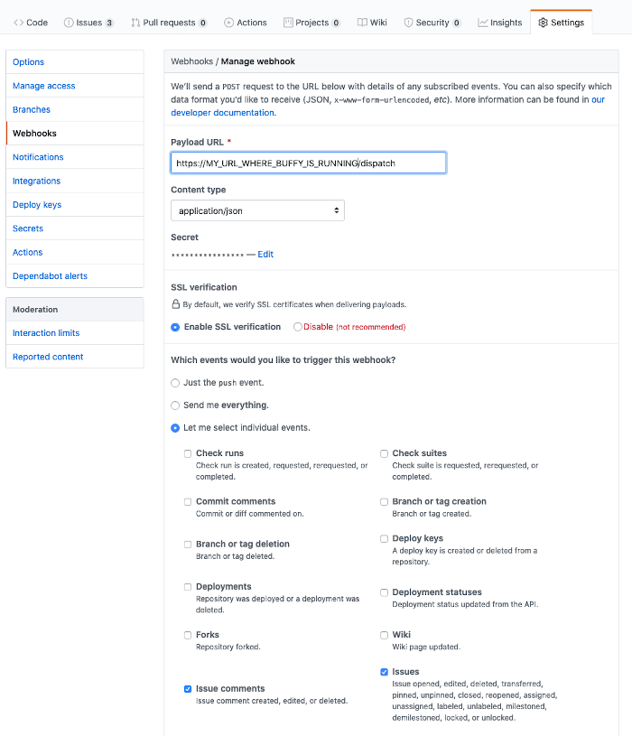

# Buffy

A service to provide a bot helping scientific journals manage submission reviews.

Buffy automates common editorial tasks like those needed by [The Journal of Open Source Software](https://joss.theoj.org/) or [rOpenSci](https://ropensci.org/).

## Installation

Buffy works listening to events received from GitHub and deciding if/how to reply by passing the received payload to different Responders.
You can fork Buffy and configure the responders you want to use for any specific repository. To have Buffy ready and listening to events you can install it locally or deploy it to a server or service platform.
You'll need the following components:

- A GitHub user to use as the bot with admin permissions on the target repo (usually a member of the organization owning the repo).
- An instance of Buffy running
- A webhook configured in the GitHub repo's settings to send events to Buffy

### Create the bot GitHub user

This will be the user responding to commands in the reviews repo.

1. [Sign up in GitHub](https://github.com/join) and create the bot user:

2. Go to `Settings >> Developer settings >> Personal access tokens` and create a new token with at least this scopes: `public_repo`, `repo:invite`, `read:org` and `read:user`. Save that token, it will be your `BUFFY_GH_ACCESS_TOKEN`.

3. Give the bot admin permissions: add it as member of the organization owning the repo where the reviews will take place:

### Deploy Buffy

We will use here Heroku as an example service to deploy Buffy but you can use any other server or platform.

1. Create a new app in heroku linked to the url of your fork of Buffy. Automatically Heroku will use the `heroku/ruby` buildpack.

2. In the app settings add the following Config Vars:

        BUFFY_BOT_GH_USER: <the_github_username_of_the_bot>
        BUFFY_GH_ACCESS_TOKEN: <the_access_token_for_the_bot_created_in_the_previous_step>
        BUFFY_GH_SECRET_TOKEN: <a_random_string>
        RACK_ENV: production

3. You can set Heroku to automatically redeploy when new commits are added. You can also add heroku as a git remote and deploy manually using

        $ git push heroku master

      There are detailed instructions in the Deploy section of your Heroku app.

4. You should now have a public URL with Buffy running. You can test that pointing your browser to `/status`, like for example: `https://your-new-buffy-deploy.herokuapp.com/status` It should return a simple up and running message.

### Configure a webhook to send events from GitHub to Buffy

1. Go to the settings page of the repository where you want to use buffy. Add a new webhook.

2. Configure the new webhook with:

        Payload URL: /dispatch path at your public buffy url
        Content type: application/json
        Secret: The BUFFY_GH_SECRET_TOKEN you configured in the previous step

      Select individual events to trigger: **issue comments** and **issues**

If everything went well you should have now your bot responding on the reviews issues. Try `@botname help` for example.
