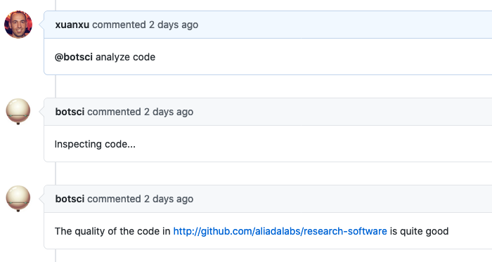
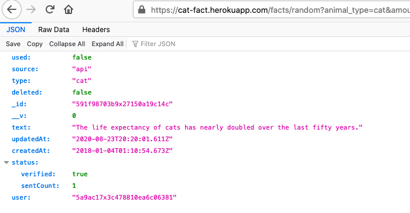
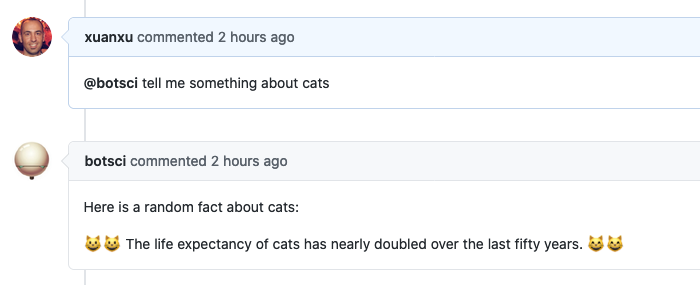

External service
================

This responder creates a background job to asynchronously call an external service's API. If the call is successful the response is posted as a comment in the issue (optionally using a template).

## Listens to

```
@botname <command>
```

For example, if you configure the command to be _check references_, it would respond to:
```
@botname check references
```

## Requirements

Some parameters are required for the responder to work: the `name` of the service, the `command` to invoke it, and the `url` of the call. All can be set using the settings YAML file.

### If using a template

If you want to use a template to respond, Buffy will look for the file declared in the `template_file` param in the target repo, in the location specified with the `template_path` setting (by default `.buffy/templates`). In short: the *template_file* should be located in the *template_path*.

The response from the external service should be in JSON format. It will be parsed and the resulting hash values will be passed to the template, where they can be used with the syntax:
```
{{variable_name}}
```

## Settings key

`external_service`

## Params
```eval_rst
:name: *Required*. The name for this service.
:command: *Required*. The command this responder will listen to.
:url: *Required*. The url to call.
:method: The HTTP method to use. Valid values: [get, post]. Default is **post**.
:description: The description of the service. It will show in the help command if the responder is not hidden.
:message: An optional message to reply when the command is received, before the external service is called.
:template_file: The optional template file to use to build the response message.
:headers: *<Array>* An optional list of *key: value* pairs to be passed as headers in the external service request.
:data_from_issue: *<Array>* An optional list of values that will be extracted from the issue's body and used to fill the template.
:query_params: *<Array>* An optional list of params to add to the query of the external call. Common place to add API_KEYS or other authentication info.
:mapping: *<Array>* An optional mapping of variable names in the query of the external service call.

```

## Examples

**A simple case using a template:**
```yaml
...
  external_service:
      name: cat_facts
      command: tell me something about cats
      description: Random facts about cats
      url: "https://cat-fact.herokuapp.com/facts/random"
      method: get
      query_params:
          animal_type: cat
          amount: 1
      template_file: cats.md
...
```
The request will be https://cat-fact.herokuapp.com/facts/random?animal_type=cat&amount=1 and the response will be passed to the _cats.md_ template.


**A complete example:**
```yaml
...
  external_service:
      - code_quality:
          only: editors
          command: analyze code
          description: Reports on the quality of the code
          message: Inspecting code...
          url: https://dummy-external-service.herokuapp.com/code-analysis
          method: post
          query_params:
            secret: A1234567890Z
          data_from_issue:
            - target-repo
          mapping:
            id: issue_id
...
```
Once the responder is invoked it will reply with _"Inspecting code..."_ as a comment in the issue.
Later, a POST request will be sent to https://dummy-external-service.herokuapp.com/code-analysis with a JSON body:
```
{
 "secret": "A1234567890Z", # declared in the query_params setting
 "target-repo":"...",      # the value is extracted from the body of the issue
 "id":"...",               # the value corresponds to issue_id, it has been mapped to id
 "repo":"...",             # the origin repo where the invokation happend
 "sender":"...",           # the user invoking the command
 "bot_name":"...",         # the bot user name that will be responding
}
```
And the response will posted as a comment in the original issue.

## In action

* **`In use:`**



### With a template as response

* **`The template file:`**


* **`The JSON response:`**



* **`In use:`**



